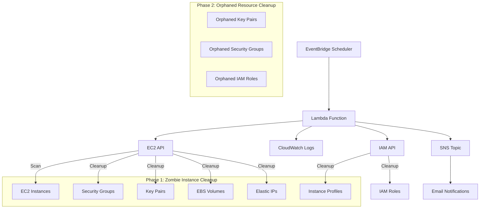
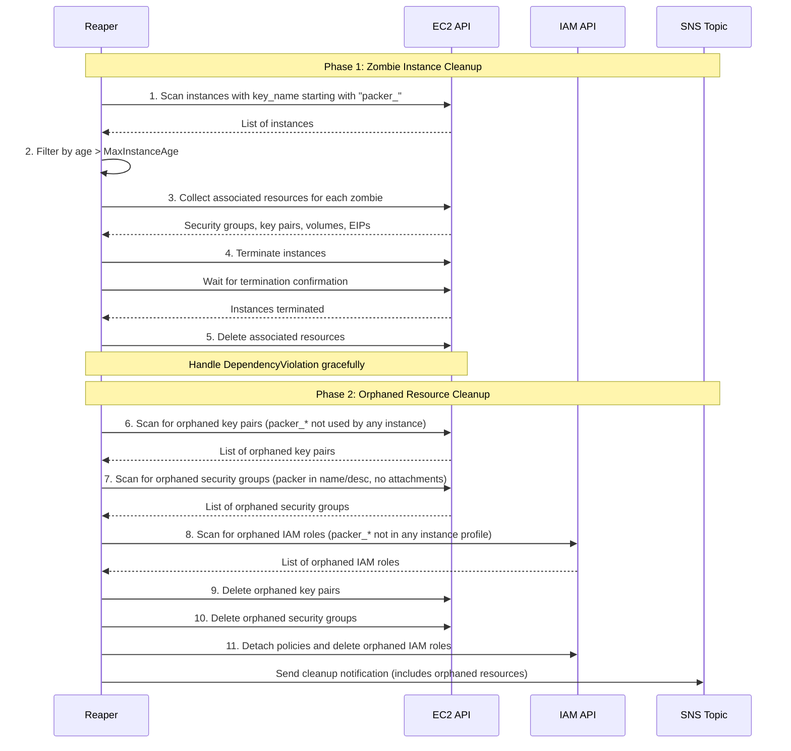
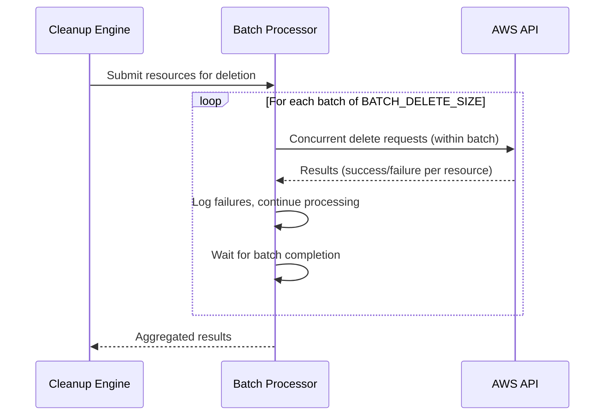

# Design Document: AWS Packer Resource Reaper

## Overview

The AWS Packer Resource Reaper is a serverless application built on AWS Lambda that automatically identifies and cleans up zombie resources left behind by failed or interrupted Packer builds. The system operates on a scheduled basis using Amazon EventBridge, implements simple two-criteria filtering to ensure safe resource identification, and executes cleanup operations in a dependency-aware sequence to avoid AWS API violations.

**⚠️ IMPORTANT WARNING:** Instances are detected by the name of the SSH key that is automatically generated by Packer (pattern: `packer_*`). **Do NOT use this application if you use similar key naming patterns** (e.g., `packer_mykey`, `packer_production`) for non-Packer instances, as they may be incorrectly identified and terminated.

**Key Design Decisions:**
- **Simple Two-Criteria Detection**: Instances are identified using only two criteria: (1) SSH key name starts with `packer_*`, and (2) instance age exceeds the configured threshold. This simple approach is reliable and easy to understand.
- **Stateless Architecture**: The system is completely stateless with no database or state persistence. Each execution performs a fresh scan, and resources that couldn't be deleted are simply re-identified in the next execution. This "eventual consistency" approach is the right choice for a reaper — attempting to track state would require DynamoDB, increasing complexity and cost.
- **Single Account/Region Scope**: The system operates strictly within the AWS account and region where it is deployed, using default Lambda execution environment credentials.
- **Two-Phase Cleanup Model**: The system performs cleanup in two phases: (1) Primary cleanup of zombie instances and their directly associated resources, followed by (2) Orphaned resource cleanup for Packer-created resources that persist without any instance association. This sequencing is vital — if both ran simultaneously, the orphan scanner might identify a Security Group as "orphaned" because its instance is currently terminating but not yet gone.
- **ThreadPoolExecutor for Concurrency**: The batch processor uses `ThreadPoolExecutor` (not `asyncio`) because boto3 is synchronous. Using `asyncio.gather` with blocking boto3 calls would execute sequentially, defeating the purpose of concurrent processing.

## Architecture

The system follows an event-driven serverless architecture:



### Component Responsibilities

- **EventBridge Scheduler**: Triggers Lambda execution at configurable intervals
- **Lambda Function**: Core reaper logic with filtering, cleanup, and logging
- **CloudWatch Logs**: Detailed execution logging and audit trail
- **SNS Topic**: Notifications for cleanup actions and dry-run reports

### Boto3 Client Management

Boto3 clients are thread-safe and can be shared across threads in `ThreadPoolExecutor`. The reaper creates clients at handler initialization and reuses them throughout execution, including during concurrent batch deletions.

## Components and Interfaces

### Lambda Function Architecture

```python
# Core module structure
reaper/
├── __init__.py
├── handler.py              # Lambda entry point
├── models.py               # Data models and types
├── filters/
│   ├── __init__.py
│   ├── base.py             # Base filter interface
│   ├── temporal.py         # Age-based filtering
│   └── identity.py         # Key pair pattern matching
├── cleanup/
│   ├── __init__.py
│   ├── engine.py           # Cleanup orchestration
│   ├── ec2_manager.py      # Instance termination
│   ├── storage_manager.py  # EBS volumes cleanup
│   ├── network_manager.py  # Security groups, key pairs, EIPs
│   ├── iam_manager.py      # IAM instance profiles and roles cleanup
│   └── orphan_manager.py   # Orphaned Packer resource cleanup
├── notifications/
│   ├── __init__.py
│   └── sns_notifier.py     # SNS message formatting
└── utils/
    ├── __init__.py
    ├── aws_client.py       # Boto3 client management
    ├── config.py           # Environment configuration
    └── security.py         # Input validation
```

### Filter Interface

The filtering system uses two simple criteria:

```python
from abc import ABC, abstractmethod
from typing import List
from reaper.models import PackerInstance

class ResourceFilter(ABC):
    """Base interface for resource filters"""
    
    @abstractmethod
    def filter_instances(self, instances: List[PackerInstance]) -> List[PackerInstance]:
        """Filter EC2 instances based on specific criteria"""
        pass
    
    @abstractmethod
    def matches(self, instance: PackerInstance) -> bool:
        """Check if a single instance matches the filter criteria"""
        pass


class IdentityFilter(ResourceFilter):
    """Filter instances by SSH key pair pattern"""
    
    KEY_PAIR_PATTERN = "packer_"
    
    def matches(self, instance: PackerInstance) -> bool:
        """Instance matches if key_name starts with 'packer_'"""
        if not instance.key_name:
            return False
        return instance.key_name.startswith(self.KEY_PAIR_PATTERN)


class TemporalFilter(ResourceFilter):
    """Filter instances by age threshold"""
    
    def __init__(self, max_age_hours: int):
        self.max_age_hours = max_age_hours
    
    def matches(self, instance: PackerInstance) -> bool:
        """Instance matches if age exceeds threshold"""
        return instance.age_hours > self.max_age_hours
```

**Design Rationale**: The filter logic is intentionally simple - only two criteria must be met:
1. Key pair name starts with `packer_*`
2. Instance age exceeds the configured MaxInstanceAge

This simplicity reduces false positives and makes the system behavior predictable.

**Implementation Note**: The `IdentityFilter` and `TemporalFilter` are implemented as separate classes (Strategy Pattern) for testability. This allows each filter to be tested independently with property-based tests, and makes it easy to extend with additional filters (e.g., Tags) if needed later. The `check if not instance.key_name: return False` handles edge cases (instances without keys) correctly, preventing AttributeError.

### Cleanup Engine Interface

```python
from dataclasses import dataclass
from typing import List, Optional

@dataclass
class CleanupResult:
    """Result of a cleanup operation"""
    terminated_instances: List[str]
    deleted_security_groups: List[str]
    deleted_key_pairs: List[str]
    deleted_volumes: List[str]
    released_eips: List[str]
    deleted_instance_profiles: List[str]
    deleted_iam_roles: List[str]
    # Orphaned resource cleanup results
    orphaned_key_pairs_deleted: List[str]
    orphaned_security_groups_deleted: List[str]
    orphaned_iam_roles_deleted: List[str]
    errors: List[str]

class CleanupEngine:
    def __init__(self, dry_run: bool = False, batch_delete_size: int = 1):
        self.dry_run = dry_run
        self.batch_delete_size = batch_delete_size
    
    def cleanup_resources(self, zombie_instances: List[PackerInstance]) -> CleanupResult:
        """
        Execute cleanup in dependency-aware order:
        Phase 1 - Primary Zombie Instance Cleanup:
        1. Identify zombie instances (already filtered)
        2. Collect directly associated resources
        3. Terminate instances and wait for confirmation
        4. Delete associated resources (using batch processing if configured)
        
        Phase 2 - Orphaned Resource Cleanup:
        5. Scan for orphaned Packer key pairs (not used by any instance)
        6. Scan for orphaned Packer security groups (no attachments)
        7. Scan for orphaned Packer IAM roles (not in any instance profile)
        8. Delete orphaned resources (using batch processing if configured)
        """
        pass
    
    def _delete_resources_in_batches(self, resources: List[str], delete_func) -> List[str]:
        """
        Process resource deletions in configurable batches.
        
        When batch_delete_size > 1, deletions within each batch are processed
        concurrently using ThreadPoolExecutor (NOT asyncio, since boto3 is synchronous).
        The engine waits for all deletions in the current batch to complete 
        before proceeding to the next batch.
        
        Failures within a batch are logged but don't stop processing of
        remaining items in the batch or subsequent batches.
        """
        pass


class OrphanManager:
    """Manager for identifying and cleaning up orphaned Packer resources"""
    
    def __init__(self, dry_run: bool = False):
        self.dry_run = dry_run
    
    def scan_orphaned_key_pairs(self) -> List[str]:
        """
        Identify key pairs starting with 'packer_' that are not 
        associated with any running or pending EC2 instances.
        """
        pass
    
    def scan_orphaned_security_groups(self) -> List[str]:
        """
        Identify security groups with names or descriptions containing 'packer'
        that are not attached to any EC2 instances or network interfaces.
        """
        pass
    
    def scan_orphaned_iam_roles(self) -> List[str]:
        """
        Identify IAM roles starting with 'packer_' that are not 
        attached to any EC2 instance profiles in use.
        """
        pass
    
    def cleanup_orphaned_resources(self, orphaned: OrphanedResources) -> dict:
        """
        Delete orphaned resources after confirming no dependencies exist.
        Respects dry_run mode - logs planned actions without executing.
        """
        pass
```

## Data Models

### Resource Models

```python
from dataclasses import dataclass, field
from datetime import datetime
from typing import Dict, List, Optional

@dataclass
class PackerInstance:
    """EC2 Instance identified as a Packer zombie"""
    instance_id: str
    instance_type: str
    state: str
    launch_time: datetime
    tags: Dict[str, str]
    key_name: Optional[str]
    security_groups: List[str] = field(default_factory=list)
    iam_instance_profile: Optional[str] = None
    
    @property
    def age_hours(self) -> float:
        """Calculate instance age in hours"""
        delta = datetime.utcnow() - self.launch_time
        return delta.total_seconds() / 3600

@dataclass
class AssociatedResources:
    """Resources directly associated with a zombie instance"""
    instance_id: str
    security_group_ids: List[str] = field(default_factory=list)
    key_pair_name: Optional[str] = None
    volume_ids: List[str] = field(default_factory=list)
    eip_allocation_id: Optional[str] = None
    iam_instance_profile_name: Optional[str] = None


@dataclass
class OrphanedResources:
    """Packer-created resources that exist without any instance association"""
    orphaned_key_pairs: List[str] = field(default_factory=list)      # Key pairs starting with "packer_" not used by any instance
    orphaned_security_groups: List[str] = field(default_factory=list) # Security groups with "packer" in name/description, no attachments
    orphaned_iam_roles: List[str] = field(default_factory=list)       # IAM roles starting with "packer_" not in any instance profile
```

### Configuration Model

```python
import logging
from dataclasses import dataclass
from typing import Optional

@dataclass
class ReaperConfig:
    """Configuration for reaper execution"""
    max_instance_age_hours: int = 2
    dry_run: bool = False
    notification_topic_arn: str = ""
    log_level: str = "INFO"
    batch_delete_size: int = 1
    
    # Filter configuration
    key_pair_pattern: str = "packer_"
    
    @classmethod
    def from_environment(cls) -> 'ReaperConfig':
        """Load configuration from environment variables"""
        import os
        
        # Parse and validate LOG_LEVEL
        log_level = os.environ.get('LOG_LEVEL', 'INFO').upper()
        valid_levels = {'DEBUG', 'INFO', 'WARNING', 'ERROR', 'CRITICAL'}
        if log_level not in valid_levels:
            logging.warning(f"Invalid LOG_LEVEL '{log_level}', defaulting to INFO")
            log_level = 'INFO'
        
        # Parse and validate BATCH_DELETE_SIZE
        try:
            batch_size = int(os.environ.get('BATCH_DELETE_SIZE', '1'))
            if batch_size < 1:
                logging.warning(f"Invalid BATCH_DELETE_SIZE '{batch_size}', defaulting to 1")
                batch_size = 1
        except ValueError:
            logging.warning(f"Invalid BATCH_DELETE_SIZE, defaulting to 1")
            batch_size = 1
        
        return cls(
            max_instance_age_hours=int(os.environ.get('MAX_INSTANCE_AGE_HOURS', '2')),
            dry_run=os.environ.get('DRY_RUN', 'false').lower() == 'true',
            notification_topic_arn=os.environ.get('SNS_TOPIC_ARN', ''),
            log_level=log_level,
            batch_delete_size=batch_size,
        )
```

**Design Rationale for Configuration:**
- **LOG_LEVEL**: Defaults to INFO for production use, with DEBUG available for troubleshooting. Invalid values fall back to INFO with a warning logged.
- **BATCH_DELETE_SIZE**: Defaults to 1 (sequential) for safety. Higher values enable concurrent deletion within batches for performance optimization in high-volume environments.

## Cleanup Sequence

The cleanup engine follows a strict dependency-aware sequence with two phases:



**Design Rationale for Two-Phase Cleanup:**
- Phase 1 handles zombie instances and their directly associated resources, ensuring proper dependency ordering
- Phase 2 runs after primary cleanup completes, catching resources that may have been orphaned by previous failed builds or partial cleanups
- This separation ensures orphaned resources don't interfere with active instance cleanup and provides clear audit trails

## Error Handling

### Error Classification

1. **Retryable Errors**: Rate limiting (429), service unavailable (503)
   - Handled with exponential backoff within the same execution
2. **Dependency Errors**: DependencyViolation when resources are in transitional states
   - Logged and deferred to next execution
3. **Permanent Errors**: Access denied (403), resource not found (404)
   - Logged with detailed error information

### Retry Strategy

```python
class RetryStrategy:
    """Exponential backoff with jitter for AWS API calls"""
    
    def __init__(self):
        self.max_retries = 3
        self.base_delay = 1.0
        self.max_delay = 60.0
    
    def execute_with_retry(self, operation, *args, **kwargs):
        for attempt in range(self.max_retries + 1):
            try:
                return operation(*args, **kwargs)
            except ClientError as e:
                if self._is_retryable(e) and attempt < self.max_retries:
                    delay = min(self.base_delay * (2 ** attempt), self.max_delay)
                    delay *= (0.5 + random.random() * 0.5)  # Jitter
                    time.sleep(delay)
                else:
                    raise
```

## Logging Configuration

The system supports configurable log levels via the `LOG_LEVEL` environment variable to balance debugging needs with log volume and costs.

### Log Level Behavior

| Level | Output |
|-------|--------|
| DEBUG | Detailed information including API calls, resource attributes, and processing steps |
| INFO | Standard operational information (default), including dry-run reports |
| WARNING | Warning conditions and configuration fallbacks |
| ERROR | Error conditions and failures |
| CRITICAL | Critical failures only |

**Important**: Dry-run reports are logged at INFO level (not DEBUG), ensuring they are visible in default configurations. This allows operators to see what would be cleaned up without enabling verbose debugging.

### Logging Implementation

```python
import logging
import os

def configure_logging() -> logging.Logger:
    """Configure logging based on LOG_LEVEL environment variable"""
    log_level = os.environ.get('LOG_LEVEL', 'INFO').upper()
    valid_levels = {'DEBUG', 'INFO', 'WARNING', 'ERROR', 'CRITICAL'}
    
    if log_level not in valid_levels:
        # Default to INFO and log warning about invalid level
        logging.warning(f"Invalid LOG_LEVEL '{log_level}', defaulting to INFO")
        log_level = 'INFO'
    
    logging.basicConfig(
        level=getattr(logging, log_level),
        format='%(asctime)s - %(name)s - %(levelname)s - %(message)s'
    )
    
    return logging.getLogger('reaper')
```

**Design Rationale**: 
- Defaulting to INFO provides sufficient operational visibility without excessive log volume
- Invalid values gracefully fall back to INFO with a warning, ensuring the system remains operational
- DEBUG level is available for troubleshooting without code changes

## Batch Delete Operations

The system supports configurable batch deletion via the `BATCH_DELETE_SIZE` environment variable to optimize cleanup performance in high-volume environments.

### Batch Processing Architecture



### Batch Processing Implementation

**IMPORTANT**: The batch processor uses `ThreadPoolExecutor` (not `asyncio`) because boto3 is synchronous. Using `asyncio.gather` with blocking boto3 calls would execute sequentially on the main thread, defeating the purpose of concurrent processing.

```python
from concurrent.futures import ThreadPoolExecutor, as_completed
from typing import List, Callable, Tuple, Optional
import logging

class BatchProcessor:
    """Process resource deletions in configurable batches using ThreadPoolExecutor.
    
    Uses ThreadPoolExecutor instead of asyncio because boto3 is synchronous (blocking).
    asyncio.gather with blocking I/O would execute sequentially, not concurrently.
    ThreadPoolExecutor provides true concurrent execution for blocking boto3 calls.
    """
    
    def __init__(self, batch_size: int = 1):
        self.batch_size = max(1, batch_size)  # Ensure minimum of 1
        self.logger = logging.getLogger('reaper.batch')
    
    def process_deletions(
        self, 
        resources: List[str], 
        delete_func: Callable[[str], bool],
        resource_type: str = "resource"
    ) -> Tuple[List[str], List[str], dict]:
        """
        Process deletions in batches with concurrent execution within each batch.
        
        Args:
            resources: List of resource identifiers to delete
            delete_func: Function to delete a single resource (returns True on success)
            resource_type: Human-readable resource type for logging
            
        Returns:
            Tuple of (successful_deletions, failed_deletions, errors_dict)
        """
        successful = []
        failed = []
        errors = {}
        
        # Process in batches
        for i in range(0, len(resources), self.batch_size):
            batch = resources[i:i + self.batch_size]
            
            if self.batch_size > 1 and len(batch) > 1:
                # Concurrent processing within batch using ThreadPoolExecutor
                with ThreadPoolExecutor(max_workers=len(batch)) as executor:
                    future_to_resource = {
                        executor.submit(self._safe_delete, delete_func, resource): resource
                        for resource in batch
                    }
                    
                    # Wait for all tasks to complete
                    for future in as_completed(future_to_resource):
                        resource = future_to_resource[future]
                        try:
                            success, error_msg = future.result()
                            if success:
                                successful.append(resource)
                            else:
                                failed.append(resource)
                                if error_msg:
                                    errors[resource] = error_msg
                                self.logger.warning(f"Failed to delete {resource_type} {resource}: {error_msg}")
                        except Exception as e:
                            failed.append(resource)
                            errors[resource] = str(e)
                            self.logger.error(f"Exception deleting {resource_type} {resource}: {e}")
            else:
                # Sequential processing (batch_size = 1 or single item)
                for resource in batch:
                    success, error_msg = self._safe_delete(delete_func, resource)
                    if success:
                        successful.append(resource)
                    else:
                        failed.append(resource)
                        if error_msg:
                            errors[resource] = error_msg
                        self.logger.warning(f"Failed to delete {resource_type} {resource}: {error_msg}")
        
        return successful, failed, errors
    
    def _safe_delete(self, delete_func: Callable[[str], bool], resource_id: str) -> Tuple[bool, Optional[str]]:
        """Safely execute delete function, catching exceptions."""
        try:
            success = delete_func(resource_id)
            return (success, None if success else "Delete returned False")
        except Exception as e:
            return (False, str(e))
```

**Design Rationale for Batch Processing:**
- **ThreadPoolExecutor over asyncio**: boto3 is synchronous/blocking. `asyncio.gather` with blocking calls executes sequentially. `ThreadPoolExecutor` provides true concurrent execution for blocking I/O.
- **Default to 1 (sequential)**: Safest option, ensures predictable behavior and easier debugging
- **Concurrent within batches**: When batch_size > 1, deletions within a batch run concurrently for performance
- **Wait between batches**: Ensures all operations in current batch complete before starting next batch
- **Failure isolation**: Individual failures don't stop batch processing; errors are logged and processing continues
- **Dependency order preserved**: Batch processing is applied within each resource type, maintaining the overall dependency-aware cleanup sequence (instances → dependent resources)
- **Thread safety**: boto3 clients are thread-safe and can be shared across threads in ThreadPoolExecutor

## Development Environment

### Package Management with uv

```bash
# Install uv
curl -LsSf https://astral.sh/uv/install.sh | sh

# Setup project
uv venv
uv pip install -r requirements.txt
uv pip install -r requirements-dev.txt

# Run tests (ALWAYS use uv run)
uv run pytest
uv run pytest --cov=reaper --cov-report=term-missing
uv run pytest -k "property" -v
```

## Correctness Properties

*A property is a characteristic or behavior that should hold true across all valid executions of a system.*

### Property 1: Two-Criteria Filter Selection
*For any* set of EC2 instances, only instances that satisfy BOTH criteria (key pair starts with `packer_*` AND age exceeds threshold) should be selected for cleanup.
**Validates: Requirements 1.1, 1.2**

### Property 2: Key Pair Pattern Matching Consistency
*For any* instance key pair name, the pattern matching logic should consistently identify key pairs that start with `packer_` prefix.
**Validates: Requirements 1.2**

### Property 3: Dependency-Aware Cleanup Sequencing
*For any* set of zombie instances and their associated resources, cleanup operations should always terminate instances and wait for confirmation before attempting to delete dependent resources.
**Validates: Requirements 2.1, 2.2, 2.3, 2.4, 2.5, 2.7, 2.8**

### Property 4: Error Recovery Without State
*For any* cleanup operation that encounters a DependencyViolation error, the system should log the error and continue execution, allowing the resource to be re-identified in the next scheduled run.
**Validates: Requirements 3.1, 3.2, 3.3, 3.4, 6.1, 6.3**

### Property 5: Dry Run Safety Guarantee
*For any* resource set and configuration, when dry-run mode is enabled, the system should identify all cleanup candidates and generate complete reports without executing any destructive AWS API operations.
**Validates: Requirements 9.1, 9.2, 9.3, 9.4**

### Property 6: Configuration Validation and Parsing
*For any* set of environment variables (MaxInstanceAge, DRY_RUN, LOG_LEVEL, BATCH_DELETE_SIZE), the configuration parser should correctly validate and parse all values, defaulting to safe values when invalid inputs are provided.
**Validates: Requirements 5.2, 9.5, 11.1, 11.2, 11.5, 12.1, 12.2, 12.7**

### Property 7: Comprehensive Logging and Notification
*For any* cleanup operation or dry-run execution, the system should log all scanned resources and actions to CloudWatch, and SNS notifications should include instance ID, type, termination reason, and list of deleted associated resources.
**Validates: Requirements 4.2, 4.3, 4.4**

### Property 8: Security and Scope Enforcement
*For any* system execution, all operations should only access resources within the configured scope (matching filters), and sensitive information should not be exposed in CloudWatch logs.
**Validates: Requirements 7.2, 7.4, 8.1, 8.2, 8.3, 8.4, 8.5, 8.6**

### Property 9: Single Account/Region Boundary
*For any* system execution, the system should only use default Lambda execution environment credentials and should never attempt cross-account or cross-region operations.
**Validates: Requirements 8.1, 8.2, 8.3, 8.4, 8.5, 8.6**

### Property 10: Orphaned Resource Identification
*For any* set of Packer-created resources (key pairs starting with `packer_`, security groups containing `packer`, IAM roles starting with `packer_`), the system should correctly identify those that are orphaned (not associated with any running/pending instances, not attached to any network interfaces, not in any active instance profiles).
**Validates: Requirements 10.1, 10.2, 10.3**

### Property 11: Orphaned Resource Cleanup Safety
*For any* orphaned resource cleanup operation, the system should only delete resources after confirming no dependencies exist, and should respect dry-run mode by logging planned actions without executing destructive operations.
**Validates: Requirements 10.4, 10.5, 10.6, 10.7, 10.8, 10.9, 10.10**

### Property 12: Log Level Configuration
*For any* LOG_LEVEL environment variable value, the system should use the specified level if valid (DEBUG, INFO, WARNING, ERROR, CRITICAL), or default to INFO with a warning if invalid.
**Validates: Requirements 11.1, 11.2, 11.3, 11.4, 11.5**

### Property 13: Batch Delete Processing
*For any* set of resources to delete and BATCH_DELETE_SIZE configuration, the system should process deletions in batches of the specified size, with concurrent execution within batches, while maintaining dependency-aware cleanup order and continuing processing when individual deletions fail.
**Validates: Requirements 12.1, 12.2, 12.3, 12.4, 12.5, 12.6, 12.7**

## Testing Strategy

### Dual Testing Approach

**Unit Tests** focus on:
- Specific examples demonstrating correct behavior
- Edge cases (no key pair, empty key pair name, exact threshold boundary)
- AWS API client interactions with mocked responses
- Configuration parsing and validation (including LOG_LEVEL and BATCH_DELETE_SIZE)
- Orphaned resource identification edge cases (resources with partial matches, boundary conditions)
- Batch processing edge cases (empty batches, single item, failures within batches)

**Property-Based Tests** focus on:
- Universal properties across randomized inputs
- Filter logic correctness
- Safety guarantees under all conditions
- Orphaned resource detection accuracy
- Two-phase cleanup ordering guarantees
- Log level configuration validation
- Batch processing behavior with various batch sizes

### Property-Based Testing Configuration

**Framework**: Hypothesis for Python
- Minimum 100 iterations per property test
- Test tagging: `# Feature: packer-resource-reaper, Property {number}: {property_text}`

```bash
# Run all tests
uv run pytest

# Run property-based tests only
uv run pytest -k "property" -v
```

## Security Considerations

### IAM Least Privilege

Required permissions:
- `ec2:DescribeInstances`, `ec2:DescribeSecurityGroups`, `ec2:DescribeKeyPairs`, `ec2:DescribeVolumes`, `ec2:DescribeAddresses`, `ec2:DescribeNetworkInterfaces` - scanning (including orphaned resource detection)
- `ec2:TerminateInstances` - instance termination
- `ec2:DeleteSecurityGroup`, `ec2:DeleteKeyPair`, `ec2:DeleteVolume`, `ec2:ReleaseAddress` - cleanup (including orphaned resources)
- `iam:ListInstanceProfiles`, `iam:GetInstanceProfile`, `iam:ListRoles`, `iam:ListAttachedRolePolicies`, `iam:ListRolePolicies` - IAM scanning (including orphaned roles)
- `iam:DeleteInstanceProfile`, `iam:RemoveRoleFromInstanceProfile`, `iam:DeleteRole`, `iam:DetachRolePolicy`, `iam:DeleteRolePolicy` - IAM cleanup (for profiles/roles matching `packer_*`)
- `sns:Publish` - notifications
- `logs:CreateLogGroup`, `logs:CreateLogStream`, `logs:PutLogEvents` - logging

### Input Validation

- MaxInstanceAge must be a positive integer
- DRY_RUN must be explicitly "true" or "false"
- SNS topic ARN format is validated before use
- LOG_LEVEL must be one of: DEBUG, INFO, WARNING, ERROR, CRITICAL (defaults to INFO if invalid)
- BATCH_DELETE_SIZE must be a positive integer (defaults to 1 if invalid or non-positive)
